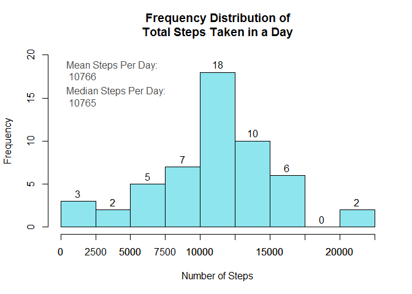
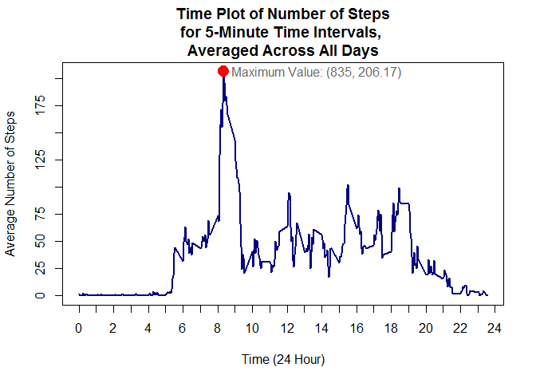
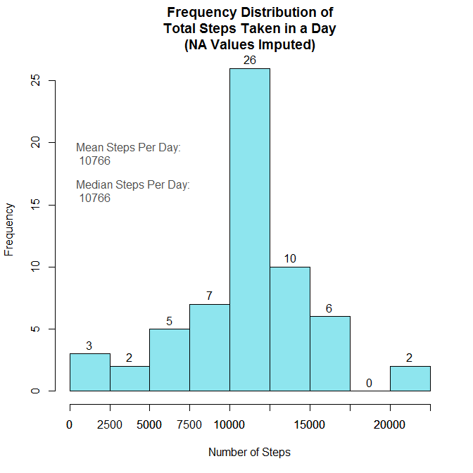
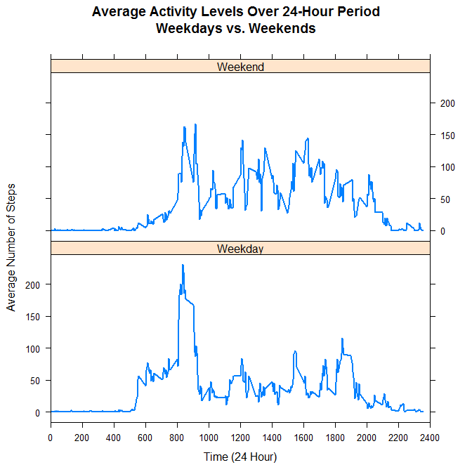

# Reproducible Research: Peer Assessment 1
Fenton Taylor  


First, the data must be loaded. The code checks to see if the file has been unzipped or not. If it has not, it unzips it. If the unzipped file exists, the data is read and stored as the R object 'act'.


```r
setwd("C:/Users/sec/Desktop/Coursera/projects/RepData_PeerAssessment1")
if(!file.exists("activity.csv")){
      unzip("activity.zip")
}
act <- read.csv("activity.csv")
```

## What is the mean total number of steps taken per day?

```r
stepsDF <- aggregate(act$steps, list(act$date), "sum")
names(stepsDF) <- c("date","totalsteps")
hist(stepsDF$totalsteps, 
     breaks = seq(0,22500, by = 2500),
     main = "Frequency Distribution of\nTotal Steps Taken in a Day",
     xlab = "Number of Steps",
     xlim = range(seq(0,22500, by = 2500)),
     ylim = c(0,20),
     col = "cadetblue2",
     labels = TRUE)
axis(side = 1,
     at = seq(0,22500, by = 2500))
stepsMean <- floor(mean(stepsDF$totalsteps, na.rm = TRUE))
stepsMedian <- floor(median(stepsDF$totalsteps, na.rm = TRUE))

text(x = 0, y = 18,
     col = "gray30",
     pos = 4,
     labels = paste("Mean Steps Per Day:\n",stepsMean))
text(x = 0, y = 15,
     col = "gray30",
     pos = 4,
     labels = paste("Median Steps Per Day:\n",stepsMedian))
```

<!-- -->

The subject averages approximately 10766 steps per day. On some days, it is possible that the subject did not wear the device, which could explain the missing values for certain days. Also, the subject may not have worn the device the entire day in some instances, which could account for the apparent peak in the 0-2500 steps range. 


## What is the average daily activity pattern?


```r
dailyDF <- aggregate(steps ~ interval, data = act, "mean")
with(dailyDF, plot(interval, steps,
      type = "l",
      axes = FALSE,
      lwd = 2,
      col = "navy",
      xlab = "Time (24 Hour)",
      ylab = "Average Number of Steps",
      main = "Time Plot of Number of Steps\nfor 5-Minute Time Intervals, \nAveraged Across All Days"))
box(col = "black")
axis(side =1, 
     at = seq(0,2400,100), 
     labels = seq(0,24,1))
axis(side =2, 
     at = seq(0,225,25), 
     labels = TRUE)

xmax <- dailyDF$interval[which(dailyDF$steps == max(dailyDF$steps))]
ymax <- round(max(dailyDF$steps),2)
points(xmax, ymax, 
       col="red",
       cex=2, 
       pch = 19)
text(xmax, ymax, 
     col = "gray40",
     pos = 4,
     labels = paste0("Maximum Value: (",xmax,", ",ymax,")"))
```

<!-- -->

At 8:35, the subject has the highest average activity level at 206.17 steps over the 5-minute interval. This could indicate either a regular exercise routine such as walking or jogging, or a short commute to school or work, or the relatively high level of activity associated with getting ready in the morning. The flat activity pattern for the early and late intervals indicates that the subject is likely sleeping at that time, usually going to bed between 21:30 and 22:30, and waking up around 5:30.

## Imputing missing values


```r
numNA <- sum(is.na(act$steps))
percentNA <- round(numNA/nrow(act)*100,1)
```

The data contain some missing values in the 'steps' column. There are 2304 missing values in the data, which is 13.1% of the total observations. Since 13.1% is rather high, those NA values will be replaced with the mean number of steps for that interval.


```r
act2 <-merge(act, dailyDF, by = "interval")
act2 <- act2[order(act2$date),]
names(act2)[c(2,4)]<-c("steps","meansteps")
row.names(act2)<-1:nrow(act2)

for(i in 1:length(act2$steps)){
      if(is.na(act2$steps[i])){act2$steps[i]<-act2$meansteps[i]}
}

stepsDF2 <- aggregate(act2$steps, list(act2$date), "sum")
names(stepsDF2) <- c("date","totalsteps")
hist(stepsDF2$totalsteps, 
     breaks = seq(0,22500, by = 2500),
     main = "Frequency Distribution of\nTotal Steps Taken in a Day\n(NA Values Imputed)",
     xlab = "Number of Steps",
     xlim = range(seq(0,22500, by = 2500)),
     col = "cadetblue2",
     labels = TRUE)
axis(side = 1,
     at = seq(0,22500, by = 2500))

stepsMean2 <- floor(mean(stepsDF2$totalsteps, na.rm = TRUE))
stepsMedian2 <- floor(median(stepsDF2$totalsteps, na.rm = TRUE))

text(x = 0, y = 19,
     col = "gray30",
     pos = 4,
     labels = paste("Mean Steps Per Day:\n",stepsMean2))
text(x = 0, y = 16,
     col = "gray30",
     pos = 4,
     labels = paste("Median Steps Per Day:\n",stepsMedian2))
```

<!-- -->

After imputing the missing values with the mean values for the corresponding intervals, the mean steps per day remained the same at 10766, and the median steps per day shifted slightly from 10765 to 10766. The only notable difference is that the frequency of 10,000-12,500 steps increased since all the days that had missing values now have a total number of steps within that range.

## Are there differences in activity patterns between weekdays and weekends?


```r
library(lattice)
act3 <- act2[,1:3]
act3$day <- weekdays(as.Date(act3$date))

for(i in 1:nrow(act3)){
      if(act3$day[i]=="Sunday" | act3$day[i]=="Saturday"){
            act3$day[i] <- "Weekend"
      }
      else {
            act3$day[i] <- "Weekday"
      }
}
act3 <- aggregate(steps ~ interval+day, data = act3, "mean")
xyplot(steps ~ interval | day, 
       data = act3, 
       layout = c(1,2),
       type = "l",
       lwd = 2,
       scales = list(x = list(at=seq(0,2400,200)), 
                     y = list(at = seq(0,200,50))),
       xlim = c(0,2400),
       xlab = "Time (24 Hour)",
       ylab = "Average Number of Steps",
       main = "Average Activity Levels Over 24-Hour Period\nWeekdays vs. Weekends")
```

<!-- -->

As the figure shows, the activity pattern for weekdays seems to follow a more regular pattern. This would make sense if the suject has a regular routine. However, the activity levels for the weekend are more erratic, indicating that the subject probably doesn't have a regular routine. The subject appears to have a later average wake-up time on the weekends, though.


